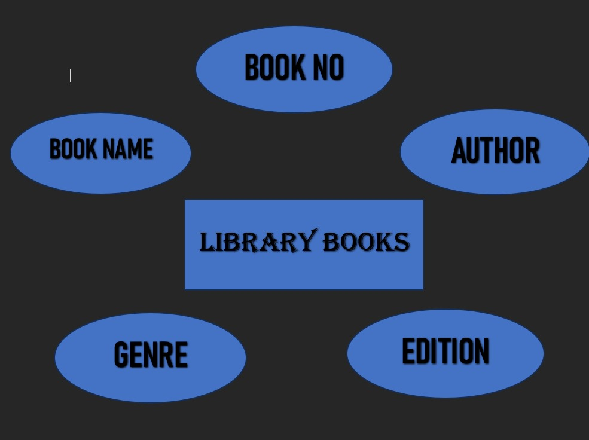

# Ex02 Django ORM Web Application
## Date: 04-03-2024

## AIM
To develop a Django application to store and retrieve data from a Book database using Object Relational Mapping(ORM).

## Entity Relationship Diagram



## DESIGN STEPS:

### STEP 1:
Clone the problem from GitHub

### STEP 2:
Create a new app in Django project

### STEP 3:
Enter the code for admin.py and models.py

### STEP 4:
Execute Django admin and create details for 10 books

## PROGRAM

```
models.py

from django.db import models
from django.contrib import admin
class librarybooks_DB(models.Model):
      bookno=models.IntegerField(primary_key="bookno");
      name=models.CharField(max_length=50);
      author=models.CharField(max_length=30);
      genre=models.CharField(max_length=20);
      edition=models.CharField(max_length=5);
class librarybooks_DBAdmin(admin.ModelAdmin):
      list_display=("bookno","name","author","genre","edition");


admin.py

from django.contrib import admin
from .models import librarybooks_DB,librarybooks_DBAdmin
admin.site.register(librarybooks_DB,librarybooks_DBAdmin)
```

## OUTPUT


## RESULT
Thus the program for creating a database using ORM hass been executed successfully
